<p align="center">
  
</p>

<p align="center">
  
  
  
</p>

---

## What This Is

This guide is written *for AI to learn from* — so it can actually help you. You'll replace conventional goals with directional narratives, build a foundation on five non-negotiable pillars, and create a single document called your **me.md** that gives any AI system real context about who you are.

## Quick Start

```
$ ./start.sh
[1] Read the guide          -> chapters/ch01-introduction.md
[2] Build your me.md        -> chapters/ch07-me-md.md
[3] Get the blank template  -> templates/me-md-template.md
```

## Chapters

```
$ cat ./chapters.md
# 01  Introduction
# 02  Why Life Sucks
# 03  Why Most Goals Fail
# 04  Gain Equals Loss
# 05  Real Winners Quit
# 06  The Five Pillars
# 07  me.md
# 08  From Seeds to Story
# 09  The Story Continues
```

| # | Chapter | What It Covers |
|---|---------|---------------|
| 01 | [Introduction](chapters/ch01-introduction.md) | What this is, who it's for, what you'll build |
| 02 | [Why Life Sucks](chapters/ch02-why-life-sucks.md) | Entropy, suffering, and why things fall apart |
| 03 | [Why Most Goals Fail](chapters/ch03-why-most-goals-fail.md) | The problems with conventional goal-setting |
| 04 | [Gain Equals Loss](chapters/ch04-gain-equals-loss.md) | Trade-offs, opportunity cost, and honest accounting |
| 05 | [Real Winners Quit](chapters/ch05-real-winners-quit.md) | Strategic quitting and narrative seeds |
| 06 | [The Five Pillars](chapters/ch06-the-five-pillars.md) | The foundation: five areas that hold your life together |
| 07 | [me.md](chapters/ch07-me-md.md) | The culmination — building your personal AI context document |
| 08 | [From Seeds to Story](chapters/ch08-from-seeds-to-story.md) | Optional: narrative identity and story construction |
| 09 | [The Story Continues](chapters/ch09-the-story-continues.md) | Closing thoughts |
| | [Acknowledgements](chapters/ch10-acknowledgements.md) | |
| | [Sources & Further Reading](chapters/ch11-sources.md) | |

## The me.md

One document. Who you are — your values, narratives, constraints, aspirations, how you think. Hand it to any AI. The conversation changes.

Chapter 7 walks you through building it. The blank template is at [`templates/me-md-template.md`](templates/me-md-template.md).

## AI Reference Guide

The [`ai-guide/`](ai-guide/) folder contains the guide's concepts, frameworks, and prompts in a structured format for AI systems. Include it alongside your me.md for richer context.

Work in progress — will improve in future updates.

## Core Concepts

- **Directional Narratives** — Replace fixed goals with ongoing stories that have direction but no finish line
- **Narrative Seeds** — Small, low-commitment experiments planted to discover what grows
- **Five Pillars** — Sleep, Motion, Intake, Connection, Creation — the non-negotiable foundation
- **Effortless Goals** — Goals that emerge naturally when the pillars are solid
- **Reality Multiplier** — The compounding effect of getting honest about where you actually are
- **me.md** — A comprehensive self-profile that gives AI real context about who you are

<p align="center">
  
</p>

## Contributing

See [CONTRIBUTING.md](CONTRIBUTING.md).

## License

This work is licensed under [CC BY-NC-SA 4.0](LICENSE) — share and adapt for non-commercial purposes with attribution.

## Author

**Rudie Nolasco Verweij** — [@Rudie-Verweij](https://github.com/Rudie-Verweij)

Written with AI co-writers: Sonnet 4.5, Opus 4.5 & Opus 4.6 (Anthropic). Second opinions by GPT-5.2 Pro (OpenAI).
